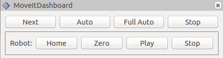

# MoveIt! Dashboard

Description: Very simple Rviz interface for interacting with custom MoveIt! applications (or any ROS application really) via ROS topics. Does not actually depend on MoveIt!

Features:

 - Custom Rviz panel
 - Buttons that trigger ROS messages
 - Rviz-based keyboard control for stepping through application
 - Interface for integrating interaction with other cpp nodes

Developed by [Dave Coleman](http://dav.ee/) at the University of Colorado Boulder

Status:

 * [](https://travis-ci.org/davetcoleman/moveit_dashboard) Travis - Continuous Integration
 * [](http://build.ros.org/view/Jsrc_uT/job/Jsrc_uT__moveit_dashboard__ubuntu_trusty__source/) ROS Buildfarm - Trusty Devel Source Build
 * [](http://build.ros.org/view/Jbin_uT64/job/Jbin_uT64__moveit_dashboard__ubuntu_trusty_amd64__binary/) ROS Buildfarm - AMD64 Trusty Debian Build



## Install

### Ubuntu Debian

> Note: this package has not been released yet

    sudo apt-get install ros-kinetic-moveit-dashboard

### Build from Source

To build this package, ``git clone`` this repo into a [catkin workspace](http://wiki.ros.org/catkin/Tutorials/create_a_workspace) and be sure to install necessary dependencies by running the following command in the root of your catkin workspace:

    rosdep install -y --from-paths src --ignore-src --rosdistro kinetic

## Code API

> Note: this package has not been released yet

See [Class Reference](http://docs.ros.org/kinetic/api/moveit_dashboard/html/)

## Usage

Publishes on the topic of ``/moveit_rviz_dashboard``

The buttons in the [Joy](http://docs.ros.org/api/sensor_msgs/html/msg/Joy.html) message correspond to the following:

```
1 - Move next
2 - Auto step
3 - Full auto
4 - Stop
Robot:
8 - Home
5 - Zero
6 - Play trajectory
7 - Stop trajectory
```

### Mouse-Based Control

Use the Rviz panel called "MoveItDashboard" to step through your program.

### Keyboard-Based Control

Switch to the "KeyTool" in the top of the Rviz window and used keyboard commands "n" and "a" for next and auto, respectively.

## Testing and Linting

To run [roslint](http://wiki.ros.org/roslint), use the following command with [catkin-tools](https://catkin-tools.readthedocs.org/):

    catkin build --no-status --no-deps --this --make-args roslint

To run [catkin lint](https://pypi.python.org/pypi/catkin_lint), use the following command with [catkin-tools](https://catkin-tools.readthedocs.org/):

    catkin lint -W2

There are currently no unit or integration tests for this package. If there were you would use the following command with [catkin-tools](https://catkin-tools.readthedocs.org/):

    catkin run_tests --no-deps --this -i

## Contribute

Please send PRs for new helper functions, fixes, etc!

<div>Icons made by <a href="http://www.flaticon.com/authors/google" title="Google">Google</a> licensed by <a href="http://creativecommons.org/licenses/by/3.0/" title="Creative Commons BY 3.0" target="_blank">CC 3.0 BY</a></div>
